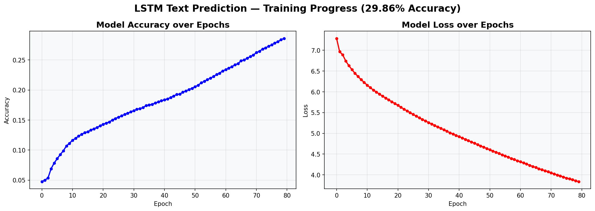

# LSTM-Text-Prediction
LSTM-based next word prediction system with FastAPI deployment

# LSTM-Based Text Prediction System with FastAPI Deployment


## Project Overview
This project implements an LSTM-based next word prediction system trained on Wikipedia data.
Given a seed sentence, the model predicts the next N words using deep learning.
The model is deployed as a REST API using FastAPI and tested via Swagger UI.

---

## Architecture
Wikipedia Data → Preprocessing → LSTM Model → FastAPI → Swagger UI

## Project Structure
LSTM-Text-Prediction/
│
├── prediction_api.py           # FastAPI server with /predict endpoint
├── tokenizer.pkl               # Saved tokenizer
├── training_progress.png       # Training accuracy and loss plots
├── README.md                   # Project documentation
└── LSTM_Text_Prediction.ipynb  # Google Colab notebook

---

## Dataset Details
| Field | Details |
|-------|---------|
| Source | Wikipedia API (wikipediaapi library) |
| Total Characters | 400,000+ |
| Vocabulary Size | 8,000 words |
| Sequence Length | 10 words |
| Total Sequences | 50,000+ |

### Topics Collected
1. Artificial Intelligence
2. Machine Learning
3. Deep Learning
4. Neural Network
5. Natural Language Processing
6. Computer Science
7. Data Science
8. Robotics
9. Computer Vision
10. Reinforcement Learning
11. Algorithm
12. Statistics
13. Python Programming Language
14. Cloud Computing
15. Information Theory

### Preprocessing Steps
1. Convert all text to lowercase
2. Remove newlines and special characters
3. Remove extra whitespace
4. Tokenize using Keras Tokenizer with vocab size 8,000
5. Create input-output sequences of length 10
6. One-hot encode output labels for classification

---

## LSTM Model Architecture
| Layer | Type | Configuration |
|-------|------|--------------|
| 1 | Embedding | input=8000, output=150 dimensions |
| 2 | LSTM | 200 units, return_sequences=True |
| 3 | Dropout | rate=0.3 |
| 4 | LSTM | 150 units |
| 5 | Dropout | rate=0.3 |
| 6 | Dense | 8000 units, activation=softmax |

---

## Mathematical Model of LSTM

**Forget Gate** — decides what information to forget from cell state:
f(t) = σ(Wf · [h(t-1), x(t)] + bf)

**Input Gate** — decides what new information to store:
i(t) = σ(Wi · [h(t-1), x(t)] + bi)
C̃(t) = tanh(Wc · [h(t-1), x(t)] + bc)

**Cell State Update** — updates the memory:
C(t) = f(t) * C(t-1) + i(t) * C̃(t)

**Output Gate** — decides what to output as hidden state:
o(t) = σ(Wo · [h(t-1), x(t)] + bo)
h(t) = o(t) * tanh(C(t))

**Where:**
- σ = sigmoid activation function
- tanh = hyperbolic tangent activation function
- W = weight matrices
- b = bias vectors
- h(t) = hidden state at time t
- C(t) = cell state at time t
- x(t) = input at time t

---

## Training Results
| Metric | Value |
|--------|-------|
| Final Accuracy | 29.86% |
| Final Loss | 3.8 |
| Total Epochs | 80 |
| Batch Size | 512 |
| Optimizer | Adam |
| Early Stopping | Patience = 5 |
| Learning Rate Scheduler | ReduceLROnPlateau |



---

## Sample Predictions
| Input | Predicted Output |
|-------|-----------------|
| artificial intelligence is | artificial intelligence is likely to solve problems in |
| deep learning models are | deep learning models are used for example in ai |
| machine learning is used | machine learning is used to solve problems in ai |
| computer science is the | computer science is the study of computer vision and |
| natural language processing is | natural language processing is used to be used to |

---

## Deployment — FastAPI

### API Endpoints
| Method | Endpoint | Description |
|--------|----------|-------------|
| GET | / | API information and available endpoints |
| GET | /health | Health check with model status |
| POST | /predict | Predict next words given seed text |

### Sample Request
```json
{
  "seed_text": "artificial intelligence is",
  "num_words": 5
}
```

### Sample Response
```json
{
  "input_text": "artificial intelligence is",
  "predicted_text": "artificial intelligence is likely to solve problems in",
  "next_words": ["likely", "to", "solve", "problems", "in"]
}
```

---

## How to Run Locally

### 1. Clone the repository
```bash
git clone https://github.com/Kavvya-2122/LSTM-Text-Prediction.git
cd LSTM-Text-Prediction
```

### 2. Install dependencies
```bash
pip install fastapi uvicorn tensorflow numpy pandas wikipediaapi pyngrok
```

### 3. Download pre-trained model
Download from Google Drive links below and place in project folder.

### 4. Run FastAPI server
```bash
uvicorn prediction_api:app --host 0.0.0.0 --port 8000
```

### 5. Open Swagger UI
http://localhost:8000/docs

---

## Pre-trained Model Download
Due to GitHub file size limits (25MB), model is hosted on Google Drive:
- https://drive.google.com/file/d/1zx5MaoIM29we_H8zqz5PgsUxDjw2fxNz/view?usp=sharing
- https://drive.google.com/file/d/15przLuAMSn-fGGQgMhdlj1RrdT_bdPHb/view?usp=sharing


## Google Colab Notebook
- https://colab.research.google.com/drive/1EwoGCIQUXSPqvpvtp533sxVidUqo3qRp#scrollTo=UfIxIxnUmSD4

---

## AI Tool Acknowledgement
| Tool | Purpose | Sections Used |
|------|---------|--------------|
| Claude (Anthropic) | Code guidance and debugging | LSTM architecture, FastAPI setup |

---

## Disclaimer
This is an academic project developed for learning purposes only.
Not intended for production use.
